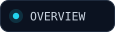
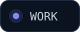
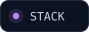

<picture>
  <source media="(max-width: 600px)" srcset="assets/hero-mobile.svg">
  
</picture>

 

&nbsp;
&nbsp;
&nbsp;
&nbsp;
&nbsp;

<picture>
  <source media="(prefers-color-scheme: dark)" srcset="assets/h-01-dark.svg">
  <source media="(prefers-color-scheme: light)" srcset="assets/h-01-light.svg">
  
</picture>

> **Full-stack developer** building AI-powered products, healthcare platforms and cross-platform apps — interface, API, database and deploy.

**Right now** — AI billing assistant for the Australian Medicare Benefits Schedule  
**Core stack** — `NestJS` · `Next.js` · `React Native` · `PostgreSQL` · `TypeScript`  
**AI work** — retrieval pipelines, embeddings and LLM assistants built *into* products  
**Off the clock** — cinematic 3D web with Three.js · learning Unity by shipping a game  
**Studying** — BSCS, final semester · Lahore Garrison University

<picture>
  <source media="(prefers-color-scheme: dark)" srcset="assets/h-02-dark.svg">
  <source media="(prefers-color-scheme: light)" srcset="assets/h-02-light.svg">
  
</picture>

<table>
<tr>
<td width="50%" valign="top">

###  Honicomb AI

**AI billing assistant for the Australian MBS**

Clinicians ask billing questions in plain language and get item-number-accurate answers.

    

</td>
<td width="50%" valign="top">

###  Circi

**AHPRA-verified GP & specialist network**

Directory, practitioner profiles and referral flows built on Australian healthcare rules.

   

</td>
</tr>
<tr>
<td width="50%" valign="top">

###  Skill Link

**Service marketplace for skilled workers**

Location-aware discovery, ratings and AI-assisted recommendations across a two-sided market.

   

</td>
<td width="50%" valign="top">

###  Aikonnect

**Content platform with a business model**

Subscriptions, reading-progress tracking, admin tooling and AI-assisted content features.

   

</td>
</tr>
<tr>
<td width="50%" valign="top">

###  CompareBestAI

**AI tool comparison engine**

Structured, explainable recommendations instead of a ranked list.

  

</td>
<td width="50%" valign="top">

###  DriverX

**Driving platform with a conversational assistant**

Chat-first UX layered over a domain-specific knowledge base.

  

</td>
</tr>
</table>

<b>&nbsp;🔍&nbsp; The engineering behind them</b> &nbsp;·&nbsp; architecture notes, if you want the detail

 

**Honicomb AI — separating language from arithmetic**  
Split in two on purpose: a retrieval-based knowledge assistant, and a **deterministic billing engine**. The LLM explains and locates the right MBS item numbers; it never calculates money. Retrieval runs on PostgreSQL with `pgvector` and an HNSW index over local embeddings, keeping latency and cost flat as the corpus grows. Deployed on EC2 behind Nginx with PM2.

**Circi — the domain is the hard part**  
Provider verification, medical taxonomy and Australian billing conventions all have to be modelled correctly before a single screen makes sense. Rendering is chosen per route — SSR for authenticated views, ISR for directory pages that need to be indexable *and* fast.

**Skill Link — two-sided marketplace mechanics**  
Matching, trust and availability decide whether the app feels usable. Real-time updates over sockets, geo-aware querying, and a schema that treats workers and customers as genuinely different entities rather than one flag on a user table.

**Aikonnect — subscriptions done properly**  
Entitlement checks live in the backend, not the UI. Stripe webhooks are idempotent, and reading progress is modelled per user per article so it survives a device change.

<picture>
  <source media="(prefers-color-scheme: dark)" srcset="assets/h-03-dark.svg">
  <source media="(prefers-color-scheme: light)" srcset="assets/h-03-light.svg">
  
</picture>

<b>F R O N T E N D</b> 

<b>M O B I L E&nbsp;&nbsp;·&nbsp;&nbsp;B A C K E N D</b> 

<b>D A T A</b> 

<b>I N F R A S T R U C T U R E</b> 

<b>C R E A T I V E</b> 

 

<picture>
  <source media="(prefers-color-scheme: dark)" srcset="assets/h-04-dark.svg">
  <source media="(prefers-color-scheme: light)" srcset="assets/h-04-light.svg">
  
</picture>

<table>
<tr>
<td width="50%" valign="top">

`01` &nbsp;**Data model first**  
Most product bugs are schema decisions made too early.

</td>
<td width="50%" valign="top">

`02` &nbsp;**Deterministic where it counts**  
LLMs for language — never for money, compliance or arithmetic.

</td>
</tr>
<tr>
<td width="50%" valign="top">

`03` &nbsp;**AI as leverage**  
Claude Code and custom MCP servers in the daily loop — for speed, not instead of understanding.

</td>
<td width="50%" valign="top">

`04` &nbsp;**Ship, then own it**  
Deploys, TLS, process management and hardening are part of the job.

</td>
</tr>
</table>

<picture>
  <source media="(prefers-color-scheme: dark)" srcset="assets/h-05-dark.svg">
  <source media="(prefers-color-scheme: light)" srcset="assets/h-05-light.svg">
  
</picture>

<picture>
  <source media="(max-width: 600px)" srcset="assets/terminal-mobile.svg">
  
</picture>

<b>&nbsp;📊&nbsp; GitHub activity</b>

 

<picture>
  <source media="(prefers-color-scheme: dark)" srcset="assets/h-06-dark.svg">
  <source media="(prefers-color-scheme: light)" srcset="assets/h-06-light.svg">
  
</picture>

Open to product work — especially AI-powered applications, healthcare systems, or hard backend problems.

 

