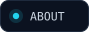
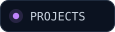
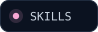
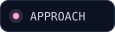
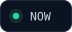
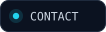

<picture>
  <source media="(max-width: 600px)" srcset="assets/hero-mobile.svg">
  
</picture>

 

&nbsp;
&nbsp;
&nbsp;
&nbsp;
&nbsp;
&nbsp;

<picture>
  <source media="(prefers-color-scheme: dark)" srcset="assets/h-01-dark.svg">
  <source media="(prefers-color-scheme: light)" srcset="assets/h-01-light.svg">
  
</picture>

I'm **Abdullah Latif**, a full-stack developer who likes owning the whole problem: the interface people touch, the API and data model underneath it, and the server that keeps it running at 3 a.m.

Most of my recent work is **AI-powered products and healthcare platforms** — systems where a wrong answer costs someone money or trust, so I care a lot about correctness, not just demos. I write TypeScript most days, reach for Python when the AI work needs it, and treat the database schema as the first design decision, not the last.

<table>
<tr>
<td width="50%" valign="top">

**📍 Based in** &nbsp;Lahore, Pakistan  
**🎯 Focus** &nbsp;AI products · healthcare platforms · cross-platform apps  
**🎓 Studying** &nbsp;BSCS, final semester

</td>
<td width="50%" valign="top">

**🧠 Strongest at** &nbsp;NestJS · Next.js · React Native · PostgreSQL  
**🤖 AI work** &nbsp;retrieval pipelines, embeddings, LLM assistants built *into* products  
**🎮 Off the clock** &nbsp;cinematic 3D web with Three.js · shipping a Unity game

</td>
</tr>
</table>

<picture>
  <source media="(prefers-color-scheme: dark)" srcset="assets/h-02-dark.svg">
  <source media="(prefers-color-scheme: light)" srcset="assets/h-02-light.svg">
  
</picture>

### Full-Stack Developer &nbsp;·&nbsp; YOUR-COMPANY &nbsp;·&nbsp; START-YEAR – Present

I build and maintain production systems for the **Australian healthcare market**, where every feature has to respect real billing and compliance rules before it can ship.

**What I'm responsible for**

- **End-to-end feature ownership** — schema design in PostgreSQL, the NestJS API, the Next.js or React Native interface, and the deploy on EC2 behind Nginx with PM2.
- **AI that stays in its lane** — retrieval pipelines on `pgvector` with HNSW indexes over local embeddings, so the LLM explains and locates the right MBS item numbers while a deterministic engine handles the arithmetic.
- **Modelling the domain correctly** — AHPRA practitioner verification, medical taxonomies and Medicare Benefits Schedule conventions, mapped into data models that hold up as the product grows.
- **Rendering chosen per route** — SSR for authenticated views, ISR for public directory pages that need to be both indexable and fast.

**Products I've shipped here** &nbsp;→&nbsp; Honicomb AI &nbsp;·&nbsp; Circi &nbsp;(details below)

<picture>
  <source media="(prefers-color-scheme: dark)" srcset="assets/h-03-dark.svg">
  <source media="(prefers-color-scheme: light)" srcset="assets/h-03-light.svg">
  
</picture>

<table>
<tr>
<td width="50%" valign="top">

###  Honicomb AI

**AI billing assistant for the Australian MBS**

Clinicians ask billing questions in plain language and get item-number-accurate answers.

    

</td>
<td width="50%" valign="top">

###  Circi

**AHPRA-verified GP & specialist network**

Directory, practitioner profiles and referral flows built on Australian healthcare rules.

   

</td>
</tr>
<tr>
<td width="50%" valign="top">

###  Skill Link

**Service marketplace for skilled workers**

Location-aware discovery, ratings and AI-assisted recommendations across a two-sided market.

   

</td>
<td width="50%" valign="top">

###  Aikonnect

**Content platform with a business model**

Subscriptions, reading-progress tracking, admin tooling and AI-assisted content features.

   

</td>
</tr>
<tr>
<td width="50%" valign="top">

###  CompareBestAI

**AI tool comparison engine**

Structured, explainable recommendations instead of a ranked list.

  

</td>
<td width="50%" valign="top">

###  DriverX

**Driving platform with a conversational assistant**

Chat-first UX layered over a domain-specific knowledge base.

  

</td>
</tr>
</table>

<b>&nbsp;🔍&nbsp; The engineering behind them</b> &nbsp;·&nbsp; architecture notes, if you want the detail

 

**Honicomb AI — separating language from arithmetic**  
Split in two on purpose: a retrieval-based knowledge assistant, and a **deterministic billing engine**. The LLM explains and locates the right MBS item numbers; it never calculates money. Retrieval runs on PostgreSQL with `pgvector` and an HNSW index over local embeddings, keeping latency and cost flat as the corpus grows. Deployed on EC2 behind Nginx with PM2.

**Circi — the domain is the hard part**  
Provider verification, medical taxonomy and Australian billing conventions all have to be modelled correctly before a single screen makes sense. Rendering is chosen per route — SSR for authenticated views, ISR for directory pages that need to be indexable *and* fast.

**Skill Link — two-sided marketplace mechanics**  
Matching, trust and availability decide whether the app feels usable. Real-time updates over sockets, geo-aware querying, and a schema that treats workers and customers as genuinely different entities rather than one flag on a user table.

**Aikonnect — subscriptions done properly**  
Entitlement checks live in the backend, not the UI. Stripe webhooks are idempotent, and reading progress is modelled per user per article so it survives a device change.

<picture>
  <source media="(prefers-color-scheme: dark)" srcset="assets/h-04-dark.svg">
  <source media="(prefers-color-scheme: light)" srcset="assets/h-04-light.svg">
  
</picture>

Tools I use in production, grouped by the job they do. Depth first, breadth second.

<table>
<tr>
<th align="left" width="18%">Area</th>
<th align="left" width="42%">Stack</th>
<th align="left">What I use it for</th>
</tr>
<tr>
<td valign="top"><b>Frontend</b></td>
<td valign="top">
 
React · Next.js · Vue · TypeScript · Tailwind · Redux
</td>
<td valign="top">SSR/ISR web apps, dashboards and admin tooling with real state management, not just pages.</td>
</tr>
<tr>
<td valign="top"><b>Mobile</b></td>
<td valign="top">
 
React Native · Expo
</td>
<td valign="top">Cross-platform apps that share logic with the web but still feel native, like Skill Link.</td>
</tr>
<tr>
<td valign="top"><b>Backend</b></td>
<td valign="top">
 
NestJS · Node.js · Express · Python
</td>
<td valign="top">Typed REST APIs, auth, idempotent webhooks, background jobs and the services AI features plug into.</td>
</tr>
<tr>
<td valign="top"><b>Data</b></td>
<td valign="top">
 
PostgreSQL · pgvector · Prisma · MongoDB · Supabase · Firebase
</td>
<td valign="top">Schema design, migrations, geo queries and vector search living next to the relational data.</td>
</tr>
<tr>
<td valign="top"><b>AI &amp; Retrieval</b></td>
<td valign="top">
   
</td>
<td valign="top">Retrieval assistants with HNSW indexes, chunking strategies, evals and cost modelling, plus workflow automation.</td>
</tr>
<tr>
<td valign="top"><b>Infrastructure</b></td>
<td valign="top">
 
AWS EC2 · Docker · Nginx · PM2 · Vercel · Cloudflare · Git
</td>
<td valign="top">Deploys, TLS, process management and hardening. If I shipped it, I run it.</td>
</tr>
<tr>
<td valign="top"><b>Payments &amp; Realtime</b></td>
<td valign="top">
  
</td>
<td valign="top">Subscriptions and entitlements enforced server-side, live updates over sockets.</td>
</tr>
<tr>
<td valign="top"><b>Creative</b></td>
<td valign="top">
 
Three.js · GSAP · Unity · Figma
</td>
<td valign="top">Scroll-driven 3D web experiences, game development and designing the screens before building them.</td>
</tr>
</table>

<picture>
  <source media="(prefers-color-scheme: dark)" srcset="assets/h-05-dark.svg">
  <source media="(prefers-color-scheme: light)" srcset="assets/h-05-light.svg">
  
</picture>

Four rules I keep coming back to. They're the difference between a demo and a product.

<table>
<tr>
<td width="50%" valign="top">

`01` &nbsp;**Data model first**  
Most product bugs are schema decisions made too early. I design the tables and relationships before the screens.

</td>
<td width="50%" valign="top">

`02` &nbsp;**Deterministic where it counts**  
LLMs for language — never for money, compliance or arithmetic. Those paths get code, tests and audit trails.

</td>
</tr>
<tr>
<td width="50%" valign="top">

`03` &nbsp;**AI as leverage**  
Claude Code and custom MCP servers are in my daily loop — for speed, not instead of understanding what ships.

</td>
<td width="50%" valign="top">

`04` &nbsp;**Ship, then own it**  
Deploys, TLS, process management and hardening are part of the job, not someone else's ticket.

</td>
</tr>
</table>

<picture>
  <source media="(prefers-color-scheme: dark)" srcset="assets/h-06-dark.svg">
  <source media="(prefers-color-scheme: light)" srcset="assets/h-06-light.svg">
  
</picture>

### BS Computer Science &nbsp;·&nbsp; Lahore Garrison University &nbsp;·&nbsp; final semester

Studying while shipping production software, which means the theory gets tested against real systems the same week I learn it. The parts I lean on most: databases, distributed systems, and the algorithms behind search and retrieval.

**Always learning** &nbsp;→&nbsp; hybrid search and RAG evaluation &nbsp;·&nbsp; Unity game development &nbsp;·&nbsp; scroll-driven 3D on the web

<picture>
  <source media="(prefers-color-scheme: dark)" srcset="assets/h-07-dark.svg">
  <source media="(prefers-color-scheme: light)" srcset="assets/h-07-light.svg">
  
</picture>

<picture>
  <source media="(max-width: 600px)" srcset="assets/terminal-mobile.svg">
  
</picture>

 

<picture>
  <source media="(prefers-color-scheme: dark)" srcset="assets/h-08-dark.svg">
  <source media="(prefers-color-scheme: light)" srcset="assets/h-08-light.svg">
  
</picture>

I'm open to product work — especially **AI-powered applications, healthcare systems, or hard backend problems**. If you're building something where correctness matters, I'd like to hear about it. Email is the fastest way to reach me.

 

