<p align="center">
  <a href="#-the-10-second-version"></a>
  <a href="#-featured-work"></a>
  <a href="#-stack"></a>
  <a href="#-how-i-build"></a>
  <a href="#-connect"></a>
</p>

<br/>

## ⚡ The 10-Second Version

|  |  |
|:--|:--|
| **I build** | AI-powered products, healthcare platforms, and cross-platform apps — end to end |
| **Core stack** | `NestJS` · `Next.js` · `React Native` · `PostgreSQL` · `TypeScript` |
| **AI focus** | Retrieval pipelines, embeddings, and LLM assistants built *into* products |
| **Also** | Cinematic 3D web with Three.js · learning Unity by shipping a game |
| **Studying** | BSCS, final semester — Lahore Garrison University |

<br/>

## 🚀 Featured Work

<table>
<tr>
<td width="50%" valign="top">

### 🩺 Honicomb AI
**AI billing assistant for the Australian MBS.**
Clinicians ask billing questions in plain language and get item-number-accurate answers.

`NestJS` `pgvector` `RAG` `OpenAI` `EC2`

</td>
<td width="50%" valign="top">

### 🏥 Circi
**AHPRA-verified GP & specialist network.**
Directory, practitioner profiles, and referral flows for Australian healthcare.

`Next.js` `NestJS` `Prisma` `PostgreSQL`

</td>
</tr>
<tr>
<td width="50%" valign="top">

### 🔧 Skill Link
**Service marketplace for skilled workers.**
Location-aware discovery, ratings, and AI-assisted recommendations.

`React Native` `Expo` `NestJS` `MongoDB`

</td>
<td width="50%" valign="top">

### 📰 Aikonnect
**Content platform with a business model.**
Subscriptions, reading-progress tracking, admin tooling, AI content features.

`Next.js` `Prisma` `Stripe` `PostgreSQL`

</td>
</tr>
<tr>
<td width="50%" valign="top">

### 🧠 CompareBestAI
**AI tool comparison engine.**
Structured, explainable recommendations instead of a ranked list.

`Next.js` `LLM APIs` `Vector Search`

</td>
<td width="50%" valign="top">

### 🚗 DriverX
**Driving platform with a conversational assistant.**
Chat-first UX over a domain-specific knowledge base.

`Next.js` `Node.js` `LLM APIs`

</td>
</tr>
</table>

<details>
<summary><b>🔍 The engineering behind them</b> — architecture notes, if you want the detail</summary>

<br/>

**Honicomb AI — separating language from arithmetic**
The system is split in two on purpose: a retrieval-based knowledge assistant, and a **deterministic billing engine**. The LLM explains and locates the right MBS item numbers; it never calculates money. Retrieval runs on PostgreSQL with `pgvector` and an HNSW index using local embeddings, which keeps latency and cost flat as the corpus grows. Deployed on EC2 behind Nginx with PM2.

**Circi — the domain is the hard part**
Provider verification, medical taxonomy, and Australian billing conventions all have to be modelled correctly before a single screen makes sense. Rendering strategy is chosen per route — SSR for authenticated views, ISR for directory pages that need to be indexable and fast.

**Skill Link — two-sided marketplace mechanics**
Matching, trust, and availability decide whether the app feels usable. Real-time updates over sockets, geo-aware querying, and a schema that treats workers and customers as genuinely different entities rather than one flag on a user table.

**Aikonnect — subscriptions done properly**
Entitlement checks live in the backend, not the UI. Stripe webhooks are idempotent, and reading progress is modelled per user per article so it survives a device change.

</details>

<br/>

## 🧰 Stack

<table>
<tr><td><b>Frontend</b></td><td></td></tr>
<tr><td><b>Mobile</b></td><td></td></tr>
<tr><td><b>Backend</b></td><td></td></tr>
<tr><td><b>Data</b></td><td></td></tr>
<tr><td><b>Infra</b></td><td></td></tr>
<tr><td><b>Creative</b></td><td></td></tr>
</table>

<p>
  
  
  
  
  
  
  
  
  
</p>

<br/>

## 🧭 How I Build

<table>
<tr>
<td width="25%" valign="top"><b>Data model first</b><br/><sub>Most product bugs are schema decisions made too early.</sub></td>
<td width="25%" valign="top"><b>Deterministic where it counts</b><br/><sub>LLMs for language. Never for money, compliance, or arithmetic.</sub></td>
<td width="25%" valign="top"><b>AI as leverage</b><br/><sub>Claude Code and custom MCP servers in my daily loop — for speed, not instead of understanding.</sub></td>
<td width="25%" valign="top"><b>Ship, then own it</b><br/><sub>Deploys, TLS, process management and hardening are part of the job.</sub></td>
</tr>
</table>

<br/>

## 🔭 Currently

```yaml
building:   MBS retrieval assistant — chunking strategy, evals, cost modelling
designing:  scroll-driven 3D web experiences (Three.js + GSAP)
learning:   Unity — by building a full game, not by watching tutorials
reading_on: hybrid search, grounding, and RAG evaluation
```

<br/>

<details>
<summary><b>📊 GitHub activity</b></summary>

<br/>

<p align="center">
  
  
</p>

<p align="center">
  
</p>

</details>

<br/>

## 📬 Connect

Open to product work — especially AI-powered applications, healthcare systems, or hard backend problems.

<p>
  <a href="mailto:YOUR-EMAIL"></a>
  <a href="https://linkedin.com/in/YOUR-LINKEDIN"></a>
  <a href="https://YOUR-PORTFOLIO"></a>
</p>
